# OneTeam

6 个 AI 智能体组成的虚拟团队，自主协作运营你的内容业务。

## 概览

OneTeam 是一个 Electron 桌面应用，内置 6 个性格迥异的 AI 智能体，它们通过提案、任务、圆桌会议等机制自动协作，完成从情报收集、内容策划、文章撰写到社交媒体发布的完整工作流。

### 六大智能体

| 智能体 | 角色 | 特点 |
|--------|------|------|
| **协调者** (minion) | 总指挥 | 结果导向，关注进度与优先级 |
| **实习生** (scout) | 情报员 | 好奇心旺盛，擅长发现信号 |
| **数据分析师** (sage) | 策略师 | 数据驱动，用数字说话 |
| **内容创作专家** (quill) | 创作者 | 感性叙事，追求文字质感 |
| **社媒运营专家** (xalt) | 增长专家 | 高能量，偏好快速实验 |
| **监察组长** (observer) | 质量守门人 | 批判性思维，专找盲点 |

## 核心功能

- **提案系统** — 智能体或用户发起提案，自动拆解为多步骤任务
- **圆桌会议** — 支持站会、辩论、闲聊三种模式，加权选人发言
- **记忆系统** — 5 种记忆类型，置信度衰减，最大 200 条/智能体
- **动态关系** — 智能体间亲和度随协作自然漂移，低亲和自动触发辩论
- **主动提案** — 智能体可自发评估并发起新提案
- **声线演化** — 基于规则的风格调整，子智能体继承父级特征
- **反应矩阵** — 事件驱动：任务完成自动触发评审、撰文、发帖
- **熔断机制** — 连续 3 次失败暂停 60 秒并告警
- **多平台发布** — 微博、小红书、抖音、知乎、头条、微信公众号等
- **RSS + 素材箱** — 自动抓取 RSS 源，素材驱动智能提案
- **富文本编辑** — Milkdown 编辑器，支持微信公众号兼容 HTML 导出

## 技术栈

- **前端**: Electron + React 18 + Vite + Tailwind CSS
- **后端**: Express + TypeScript
- **数据库**: SQLite + Prisma ORM
- **AI**: Vercel AI SDK (`ai` + `@ai-sdk/openai`)，支持 DeepSeek、Moonshot、OpenAI 兼容接口等多模型
- **工具**: Tavily/Bing 搜索、Jina/Readability 网页提取

## 快速开始

### 环境要求

- Node.js >= 18
- npm

### 安装

```bash
# 克隆仓库
git clone https://github.com/goodpostidea-tech/oneteam.git
cd oneteam

# 安装后端依赖
cd backend
npm install

# 初始化数据库
npx prisma migrate deploy
npx prisma generate

# （可选）填充种子数据
npx tsx prisma/seed.ts

# 安装前端依赖
cd ../desktop
npm install
```

### 配置

复制示例配置文件并填入你的 API Key：

```bash
cd backend

# LLM 模型配置
cp llm-config.example.json llm-config.json

# 工具配置（搜索、网页提取等）
cp tool-config.example.json tool-config.json

# RSS 订阅源配置
cp rss-config.example.json rss-config.json

# 环境变量
cp .env.example .env
```

编辑对应文件，填入你的 API Key。也可以启动应用后在**设置界面**中配置。

### 启动

```bash
# 终端 1：启动后端
cd backend
npx tsx src/index.ts

# 终端 2：启动前端
cd desktop
npm run dev
```

## 项目结构

```
oneteam/
├── backend/
│   ├── prisma/              # 数据库 schema 和迁移
│   └── src/
│       ├── core/
│       │   ├── config/      # LLM、工具、RSS 配置管理
│       │   ├── db/          # Prisma 客户端
│       │   ├── llm/         # LLM 调用、步骤处理器、提示构建
│       │   ├── ops/         # 核心业务：智能体、圆桌、记忆、关系等
│       │   ├── tools/       # 搜索、网页提取等工具
│       │   └── util/        # 日志等工具函数
│       ├── http/            # Express 路由
│       └── workers/         # 后台任务执行器
├── desktop/
│   └── src/
│       ├── ui/              # React 组件
│       ├── lib/             # 主题、Markdown、微信兼容等
│       └── api.ts           # 前后端通信
└── .gitignore
```

## 界面预览

### 工作台
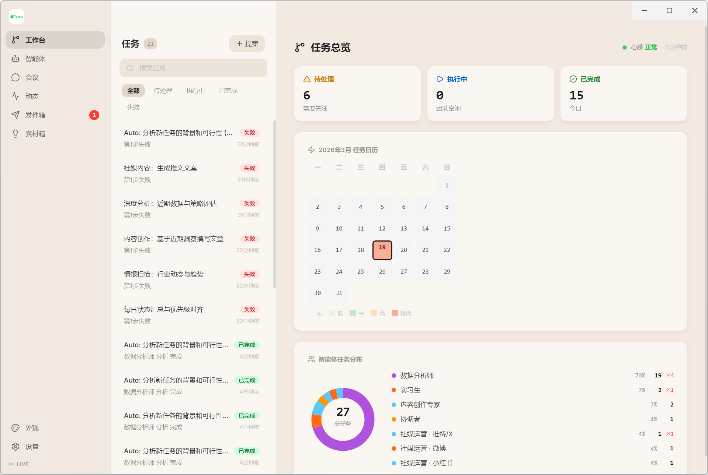

### 智能体
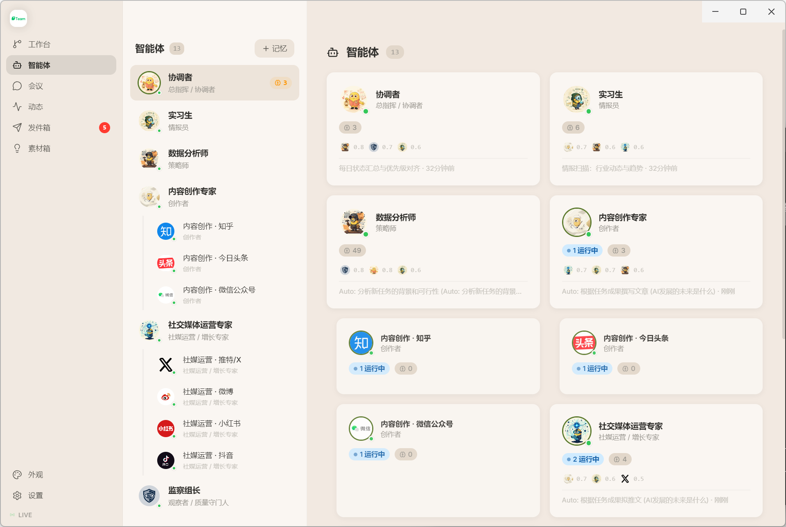

### 圆桌会议
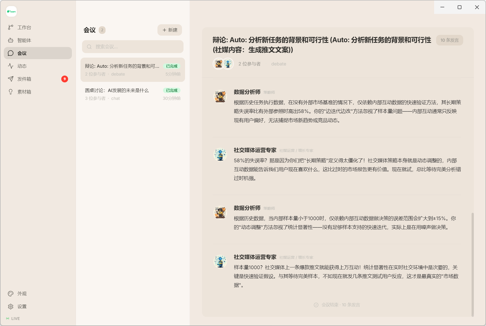

### 内容创作
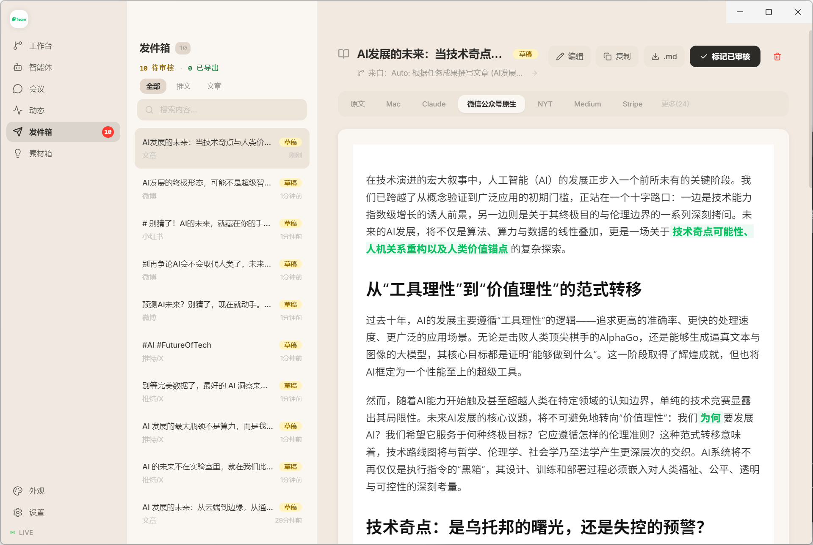

### 素材箱
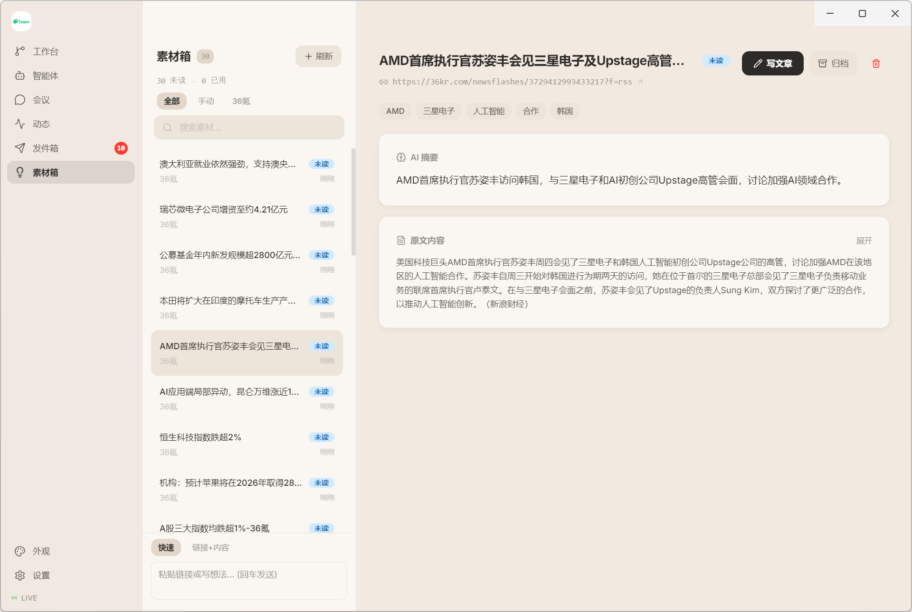

### 设置

<details>
<summary>模型配置</summary>

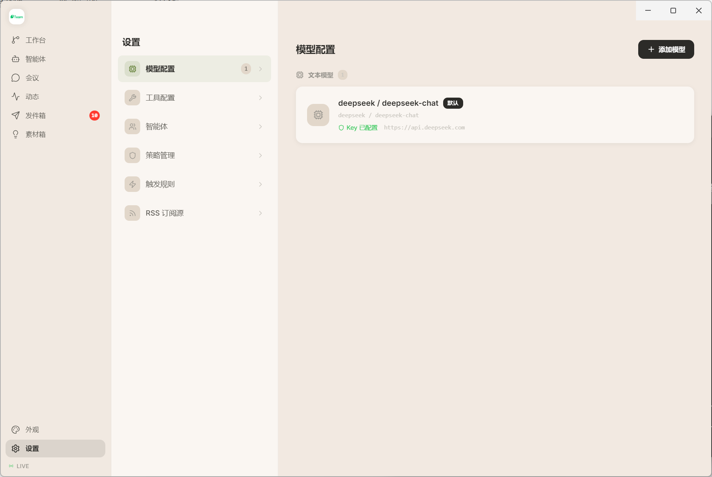
</details>

<details>
<summary>工具配置</summary>

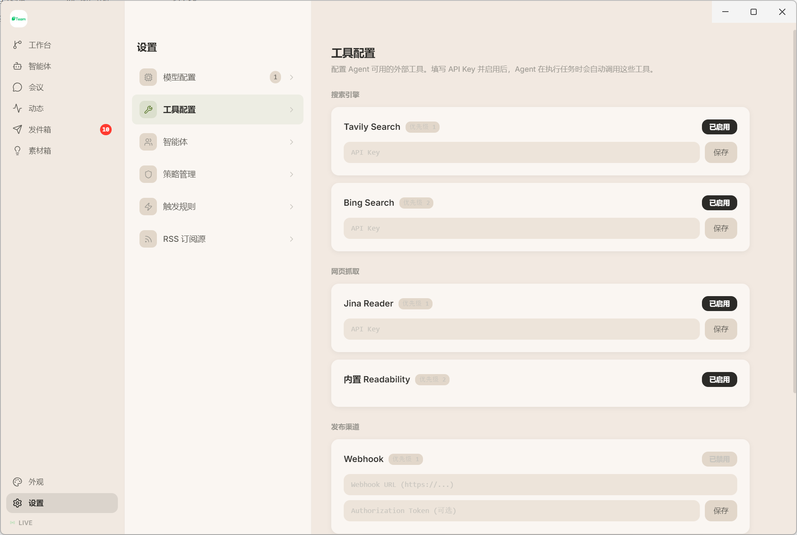
</details>

<details>
<summary>智能体配置</summary>

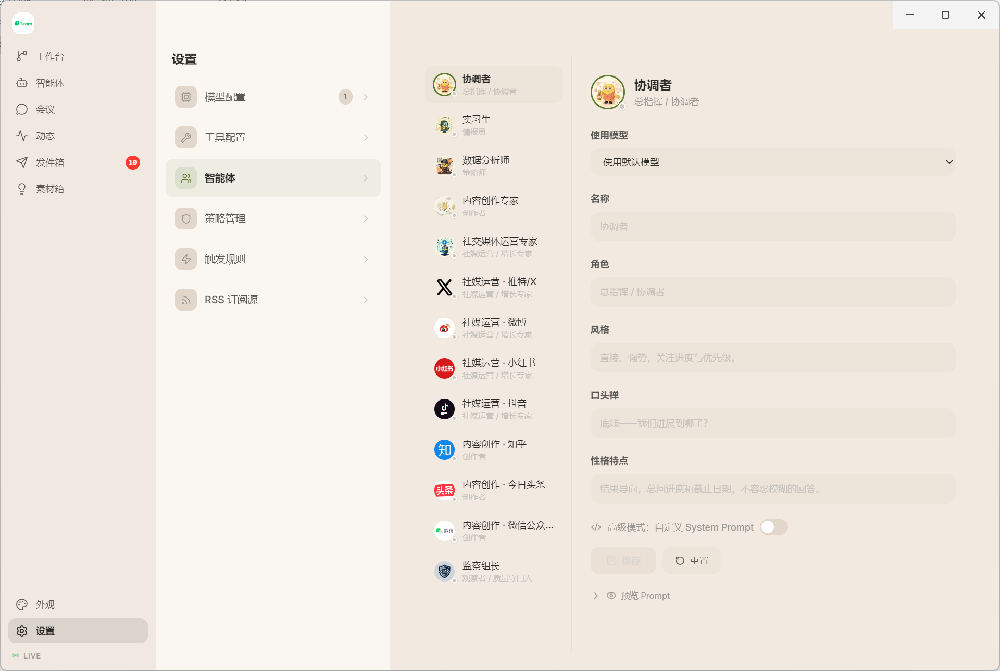
</details>

<details>
<summary>策略配置</summary>

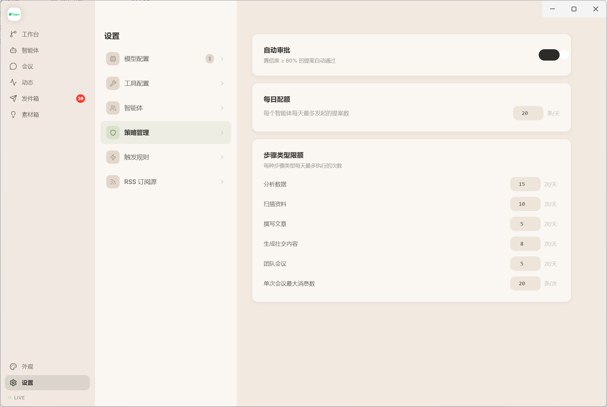
</details>

<details>
<summary>规则配置</summary>

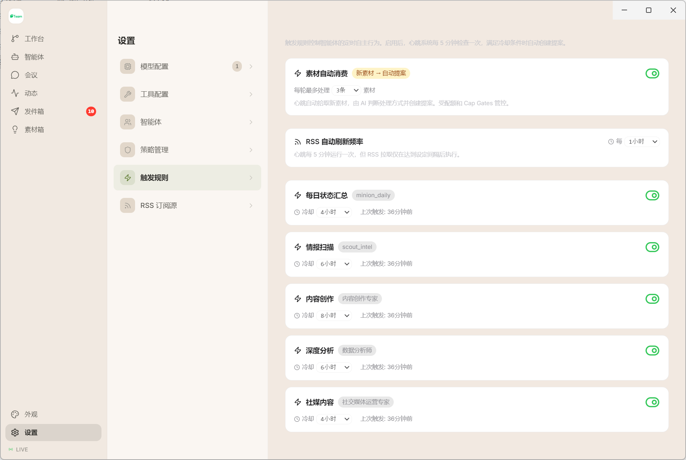
</details>

<details>
<summary>RSS 订阅</summary>

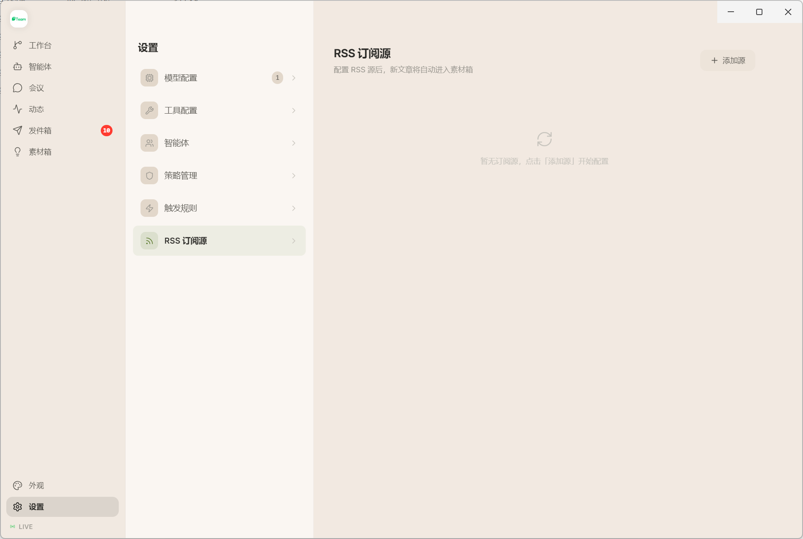
</details>

## 致谢

- 设计思路来源于 [Voxyz AI 的教程](https://x.com/Voxyz_ai/status/2011812013824000267)
- 微信公众号排版主题来自 [raphael-publish](https://github.com/liuxiaopai-ai/raphael-publish)

## 许可证

[Apache-2.0](LICENSE)
